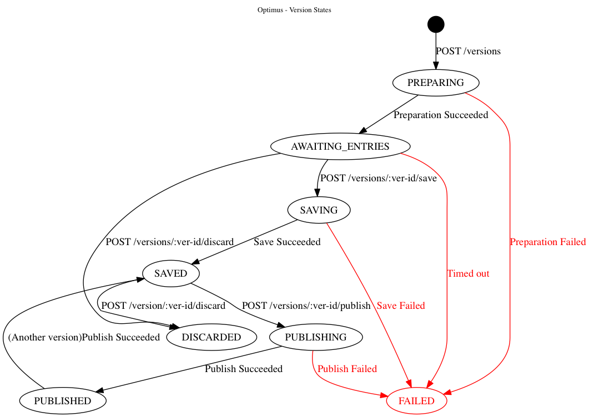
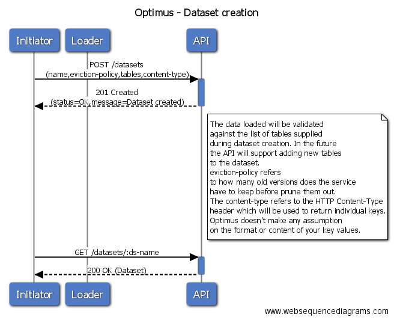
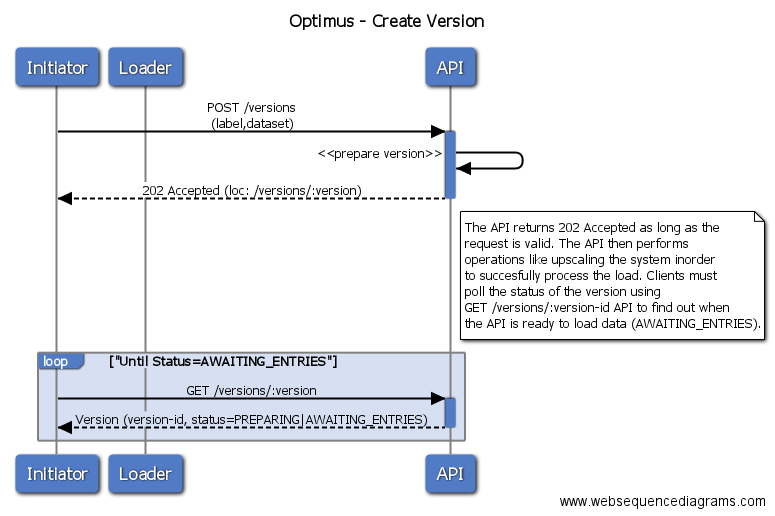
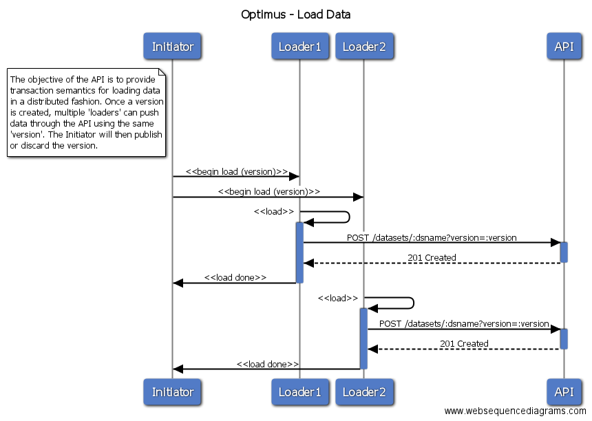
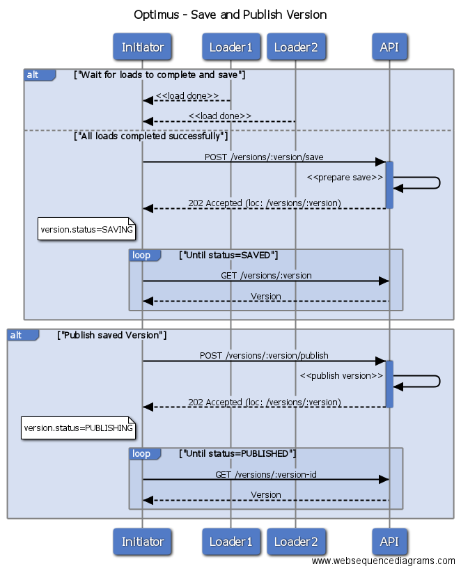
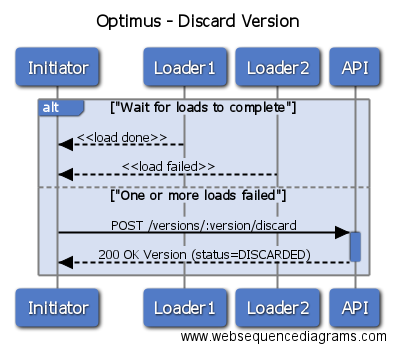

Sequence diagram showing interaction between components at a high level.

### Possible states for a version

A dataset version can be in one of the following states. The state of a version
is described by the `status` attribute.




| Status     | Description                                                   |
| ---------- | ------------------------------------------------------------- |
| PREPARING  | A request was made to create a new version (POST /versions), and the system is currently performing a set of pre-requisite operations before being able to accept data upload.|
| AWAITING_ENTRIES | The system has completed all the pre-requisite operations required for the version and is now ready to accept data for the version.|
| SAVING | A request was made to save the version (POST /versions/:version/save). The system is currently performing operations required to mark the version as `SAVED` and will no longer accept updates to this version.|
| SAVED | The version is now final and ready to be published.|
| PUBLISHING | A request was made to publish a new version (POST /version/:version/publish) and the system is now performing operations required to publish the version.|
| PUBLISHED | The system has successfully published the version. From this point on data in this version of the dataset will be used to serve all requests made to retrieve data|
| DISCARDED | A request was received to discard or abort this version (POST /versions/:version/discard). This version can no longer be published for consumption.|
| FAILED | One of the operations in the workflow failed. Refer to the state diagram above for more info.|


#### Actors

The Optimus API is generic and can be used by any type of client. For the
purposes of documentation, lets assume the following actors.

| Actor | Description |
|-------|-------------|
|Initiator| Initiator is responsible for creating a new version of the dataset and co-ordinating data load into a version. |
|Loader| Loader is responsible to load data to a version using the POST /datasets/:dataset[/tables/:table/entries] API. There can be several instances of the Loader loading data to a version in parallel.|
|API | Optimus API. |

#### Creating Datasets

#### `POST /datasets`

Create a new dataset.



```
POST /datasets

{ "name": "product-recs",
  "eviction-policy": { "type": "KEEP_LAST_X_VERSIONS", "versions": 10},
  "content-type": "application/json",
  "tables": ["users", "recommendations", "scores"]
}

---

HTTP/1.1 201 Created
Location: /datasets/XYZ123

{ "status": "OK", "message": "dataset created" }
```

`eviction-policy` refers to how many old versions the service
should keep before pruning them out.

The `content-type` refers to the HTTP Content-Type header which will
be used to return individual key values. Optimus doesn't make
any assumptions about the format or content of your key values.


#### `GET /datasets/:name`

Retrieve the current status of the datasets

```
GET /datasets/recommendations

---

HTTP/1.1 200 Created

{ "name": "product-recommendations",
  "content-type": "application/json",
  "eviction-policy": { "type": "KEEP_LAST_X_VERSIONS", "versions": 10},
  "tables": ["users", "recommendations", "scores"],
  "active-version": { "id": "XYZ123", "created-at": 123456789076},
  "available-versions: [
    { "id": "XYZ122", "created-at": 123456789076},
    { "id": "XYZ121", "created-at": 123446789076},
    { "id": "XYZ120", "created-at": 123436789076},
    { "id": "XYZ119", "created-at": 123426789076}
  ]
}
```

Here you can see the current status of a dataset and which version is being pointed at.

#### Creating a Version

In order to upload new data a new version must be created.



#### `POST /versions`

Creates a logical container for the values which are going to be uploaded.

The dataset which will be updated must be provided while initiating
a version.

```
POST /versions

{ "dataset": "product-recs" }

---

HTTP/1.1 202 Accepted
Location: /versions/XYZ123

{ "status": "OK", "message": "Request accepted", "id": "XYZ123" }
```

At this stage the service isn't ready yet to accept updates, this
operation might take a few minutes as resources might need to be
scaled-up in order to service a large amount of updates.

#### `GET /versions/:id`

Returns the current status of the given version if found, `HTTP 404` if not found.

```
GET /versions/XYZ123

---

HTTP/1.1 200 OK


{
  "version": "XYZ123",
  "label": "v1.7.4-20161123",
  "dataset": "product-recs",
  "createdAt": 123456789076,
  "status": "PREPARING"
}
```

The version can be in different states, but when marked as `AWAITING_ENTRIES`
this signals that it is ready to receive updates for the given dataset.

For a list of all possible states refer to the state diagram above.

#### Loading Data

Once the dataset has been declared and the version is ready (AWAITING_ENTRIES),
you can start pushing key/value pairs in batches and in parallel.



##### `POST /datasets/:dataset[/tables/:table/entries/:key]?version=XYZ123`

```
POST /datasets/product-recs

[{ "table": "recommendations", "key": "key1", "value": "value1"},
 { "table": "recommendations", "key": "key2", "value": "value2"},
 { "table": "recommendations", "key": "key3", "value": "value3"},
 { "table": "recommendations", "key": "keyN", "value": "valueN"}]

---

HTTP/1.1 201 Created

{ "status": "OK",
  "items-accepted": 4,
  "items-rejected": 0}
```

Or:

```
POST /datasets/product-recommendations/tables/recommendations/entries

[{ "key": "key1", "value": "value1"},
 { "key": "key2", "value": "value2"},
 { "key": "key3", "value": "value3"},
 { "key": "keyN", "value": "valueN"}]

---

HTTP/1.1 201 Created

{ "status": "OK",
  "items-accepted": 4,
  "items-rejected": 0}
```

Or:

```
POST /datasets/product-recs/tables/recommendations/entries/key1

{"value": "value1"}

---

HTTP/1.1 201 Created

{ "status": "OK",
  "items-accepted": 1,
  "items-rejected": 0}
```


#### Saving and Publishing a Version



Once all items have been loaded under a version, you can save the version or
instead explicitly void it (See Discarding a Version below).

Once the version is saved successfully, the API will stop accepting updates.
You can perform any checks/validations at this stage before publishing the
version.

#### `POST /versions/:version/save`
If all values have been uploaded successfully then you can attempt to `save`
a version.

```
POST /versions/XYZ123/save


---

HTTP/1.1 202 Accepted
Location: /versions/XYZ123

{ "status": "OK", "message": "Save in progress", "id": "XYZ123" }
```

The save operation might take a while to be executed as there are a number of
verification and optimization steps which need to be executed in this
phase. You can track the progress of the commit with `GET /versions/:id`.

At this point the save will either fail (for example because the verification
process failed), or succeed. If it fails then the version will be marked as
`FAILED` and rolled back. If it succeeds then it will be marked as `SAVED`
and it will be ready to be used as new dataset.

Once a version has been saved successfully, it is ready to be PUBLISHED as the
new dataset.

#### `POST /versions/:version/publish`

To publish a specific version you can:

```
POST /versions/XYZ123/Publish

---

HTTP/1.1 202 Accepted
Location: /versions/XYZ123

{ "status": "OK", "message": "Publish in progress"}
```

The publish operation might take a while to be executed as there are a number of
verification and optimization steps which need to be executed in this
phase. During this phase the status of the version will be PUBLISHING.
You can track the progress of the commit with `GET /versions/:id`.

Once the status of the version is set to PUBLISHED, all data requests will be
served with values from the newly published version of the dataset.

When a new version is PUBLISHED, the system will mark the previously published
version of the datasets as `SAVED` and mark the given version as `PUBLISHED`.

From this moment any GET requests which involve keys of these datasets
will be resolved to this version.

All versions for a given dataset can be listed via `GET /versions?dataset=ds1`.


#### Discarding a Version

If for any reason you realize that a version doesn't contain
the right set of values (maybe because the upload job failed)
you can explicitly void the version by discarding it.



`POST /versions/:version/discard`

```
POST /versions/XYZ123/discard

---

HTTP/1.1 200 OK
Location: /versions/XYZ123

{
  "version": "XYZ123",
  "label": "v1.7.4-20161123",
  "dataset": "product-recs",
  "createdAt": 123456789076,
  "status": "DISCARDED"
}
```

Once a version has been rolled back, it cannot be published as the new version
for a dataset.

### Retrieving data

You can retrieve the current value of a key in a table within a dataset
with the following request:

#### `GET /datasets/:dataset/tables/:table/entries/:key`

When getting a single key the `Content-type` of the response will
be the one assigned during the dataset creation.

```
GET /datasets/product-recs/tables/recommendations/entries/key1

---

HTTP/1.1 200 OK
Content-type: text/plain

value1
```

Alternatively, you can request a number of keys in a single GET.

```
GET /datasets/product-recs/tables/recommendations/entries

[{ "key": "key1},
 { "key": "key2},
 { "key": "key3},
 { "key": "keyN}]


---

HTTP/1.1 200 OK
Content-type: application/json

{
  "status": "OK",
  "keys-found": 4,
  "keys-missing": 0,
  "data": {
    "key1": "value1",
    "key2": "value2",
    "key3": "value3",
    "keyN": "valueN"
  }
}
```
