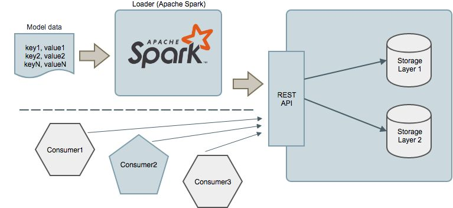

Optimus API is a key-value store which allows Data Scientists to save and
retrieve reference data and model coefficients which are calculated
across millions of users or items. The API resembles a common
key/value store, however the main difference with other REST based
key/value stores is that Optimus provides transactional semantics, which
means that while an update of a new set of keys is in progress no user
will be able to observe the new values until all keys have been
successfully stored and committed.

### Motivations

Many of the data-driven services Data Scientists develop are
simple lookups of some coefficient or a number of items predicted in advance for
a given user. These factors are calculated at regular intervals -
typically nightly or hourly - uploaded to a database and exposed via a
REST based service. While the service might have some additional
logic, typically the added value for the business is in the data
itself. While API versioning and deployment strategies to
roll-forward and roll-back are common practice in SOA systems,
we haven't found much support for similar strategies for data.
Conventional key-value stores do not provide features which
allow fine grained control over the publishing of large-scale data.

When the API which exposes a given set of factors is a mere lookup
to a database, the value of the API completely resides within the data
itself. However when data changes over time, we should be able to
control when a new set of values is ready to be consumed by API users
and provide a quick and easy way to roll back a set of coefficients
and values when we realise the data is wrong or skewed for some
reason.

So the main motivation for this service is to provide transactional
isolation semantics together with version control systems features to
a REST based key value store. Updates are typically performed across
millions of keys in a single transaction which can span over several
minutes (or hours). No consumer should ever see uncommitted
values.

This service doesn't support incremental updates for a small number of
keys. For such use cases, we recommend using DynamoDB directly (or similar
products).

### High level design

From a high level we have the following entities:

  - *Datasets*: A dataset is a collection of tables which are
    semantically linked. A dataset may contain several tables which
    are updated all together in the same version. If a data
    rollback is necessary, all tables within the dataset are rolled back
    at the same time, it is NOT possible to rollback individual tables
    in a dataset.

  - *Tables*: A table is a collection of entries.

  - *Entries*: An entry is a key/value pair. APIs provide facilities to
    read individual keys as well as group of keys.

  - *Versions*: Datasets are immutable by default and the only way to
    update a dataset is by creating a new version of the Dataset. A newly
    created version is effectively in a draft state (AWAITING_ENTRIES) and
    ready to accept new entries. Once the entries are loaded, the version
    can then be SAVED at which point the version will stop accepting new
    entries. Any reviews or validations can be carried out at this stage.
    Once the version is SAVED it can be PUBLISHED or DISCARDED. To rollback
    the dataset to a previous version, just re-publish the previous version.

There are a number of capabilities and technical goals we would like
to achieve with this system:

### Achieving Transaction Isolation using Data Versioning for models with millions of keys

As described above these models can contain large amounts of data. Some
datasets have invariant relations between values of the same set which
must be preserved even while a model is being updated. From a
consumer point of view, we would like to either see all the old values
or all the new values, and it should never be possible to observe two
values from two different versions at the same time. To achieve this
we have introduced the concept of data versions which define the boundaries
of when certain data is ready to be consumed.

The entire dataset must be updated when a new version of a dataset is created.
It is not possible to update individual keys. Once the dataset is loaded, the
version can be SAVED and PUBLISHED at which point, no more changes can be made.
At this point, the system semantically replaces all keys values for a given
dataset at once.

When a version is being published, in-flight read requests may return inconsistent
results. It is possible to achieve `repeatable reads` consistency, by explicitly
specifying the `version-id` during read requests. (Optimus API provides an endpoint
to lookup the latest active version for a dataset. The GET APIs also return the
current active version as a HTTP response header).

### Rollback

In some cases it might be necessary to revert to a previous
set of values. Reasons for this vary according to
particular usage patterns and business cases. But
the simplest reason might the that a new set of values may cause
unforeseen behaviour in downstream services (like errors). In such
cases it is useful to have a single switch to control a logical
rollback to a previous version which is known to be stable.

This is very different from an ACID database rollback. It is more like
a reverting a change in a Version Control Systems like `git`. In
our case we have to be able to efficiently and rapidly revert millions
and millions of values.

### Correctness and data integrity

When updating millions of individual values it is hard to establish
whether all keys have been written and all their values have
preserved their integrity. Optimus is designed to support customized
data integrity and correctness checks. In the future, Optimus will provide
out of the box strategies to verify data.

### Storage agnostic

While our first implementation is based on DynamoDB as backend
storage, it is clear that different datasets will have different
access patterns and latency requirements. For this reason the design
favours a storage agnostic approach whereby - for a specific use case - we
could choose a completely different storage system such as: Memcached or
Redis to provide lower latency. The choice of the backend storage
system should be completely transparent from the user perspective and
totally a service optimisation decision. By keeping the choice of
which actual storage technology is used in the hands of the Optimus service, we
could implement a hierachical storage system where datasets are
dynamically spread across different layers with different
performance characteristics and where the implementation is completely transparent to the service
users.

### Model data upload service

As part of the service we provide an Apache Spark based 'Loader' which given a
datafile with a specific format, it will upload all the key-value pairs
to the APIs. This should greatly alleviate the burden of creating
custom solutions to upload millions of keys while maintaining data integrity
in the face of partial failures and retries.

### Garbage Collection

Every model will be stored with multiple versions, for example daily
refreshes. Over time old models can be removed in order to save storage
space. This operation is completely automatic and done by the service
so that no additional work is required to perform the cleanup.

### API overview (Entries, Tables, Datasets and Versions)

Here is just an overview of the API provided by the service
and the workflow to use in order to upload an use a dataset.

`Entries` are Key-Value pairs and are the lowest unit of storage supported
by the API. Entries are logically grouped into `Tables`. These depend on your
business domain and can be things like users, recommendations, scores
etc.

`Datasets` are a logical namespace for one or more Tables. The Dataset is the
unit of update. Tables can contain many (millions) of Entries, which can be
retrieved individually by supplying the corresponding Key. However, updates
can only be done at the Dataset level.

The API provides a facility to move from one `Version` of the dataset to another
where the two sets of TableName::Key might be exactly the same, or completely
different. No restriction is applied to the transition.

Here is a list of entities and the operations supported by the API.

| Entity   | Path | Operations |
| --------- | ----------  | ----- |
| Dataset  | /datasets/[:dataset]| Create - `POST /datasets`   Retrieve - `GET /datasets/:dataset`   Load Data - `POST /datasets/:dataset` |
| Table    | /datasets/:dataset/tables | Retrieve - `GET /datasets/:dataset/tables` |
| Entry    | /datasets/:dataset/tables/:table/entries/[:key] | Retrieve - 'GET /datasets/:dataset/tables/:table/entries'   Load Data - `POST /datasets/:dataset/tables/:table/entries/[:key]` |
| Version  | /versions/[:version] | Create - `POST /versions`   Retrieve  - `GET /versions/[:version]`   Retrieve Versions for a dataset - `GET /versions?dataset=:dataset`  Save - `POST /versions/:version/save`   Publish - `POST /versions/:version/publish`   Discard - `POST /versions/:version/discard`|
